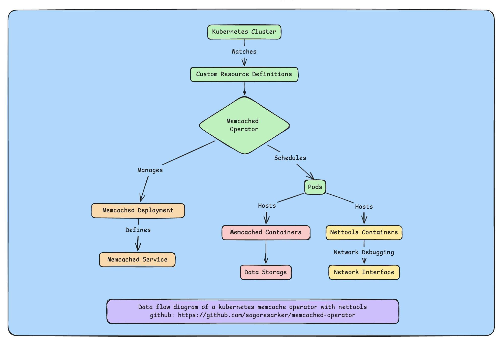

# Memcached Operator

## Overview

The Memcached Operator is a Kubernetes operator designed to automate the deployment and management of Memcached instances within a Kubernetes cluster. It leverages a custom resource definition (CRD) to manage the lifecycle of Memcached deployments.

## Here is the architecture of the operator:



## Features

- **Automated Deployment**: Simplifies the deployment of Memcached instances.
- **Scalability**: Supports scaling of Memcached deployments.
- **Status Monitoring**: Provides updates on the status of Memcached custom resources.
- **Debugging Support**: Each pod includes a debugging container (`nettools`) for network troubleshooting and diagnostics. It use nicolaka/netshoot image for nettools installation.

## Custom Resource Definition (CRD)

The operator utilizes a CRD named `MemcachedDeployment`. Below is an example configuration:

```yaml
apiVersion: cache.example.com/v1
kind: MemcachedDeployment
metadata:
  name: example-memcached
spec:
  size: 3
  image: memcached:1.4.36-alpine
```

The CRD is defined as follows:

```yaml
apiVersion: apiextensions.k8s.io/v1
kind: CustomResourceDefinition
metadata:
  name: memcacheddeployments.cache.example.com
spec:
  group: cache.example.com
  versions:
    - name: v1
      served: true
      storage: true
      schema:
        openAPIV3Schema:
          type: object
          properties:
            spec:
              type: object
              properties:
                size:
                  type: integer
                  description: "Specifies the number of Memcached instances."
                image:
                  type: string
                  description: "Defines the Docker image to use for the deployment."
  scope: Namespaced
  names:
    plural: memcacheddeployments
    singular: memcacheddeployment
    kind: MemcachedDeployment
    shortNames:
      - mcd
```

### Fields:
- `size`: Specifies the number of Memcached instances.
- `image`: Defines the Docker image to use for the deployment.

## Prerequisites

- Kubernetes cluster (v1.11.3 or higher)
- kubectl (v1.11.3 or higher)
- Go (v1.22.0 or higher)
- Docker (v17.03 or higher)

## Installation

1. Clone the repository:
   ```bash
   git clone https://github.com/sagoresarker/memcached-operator.git
   cd memcached-operator
   ```

2. Build and push the operator image:
   ```bash
   make docker-build docker-push IMG=<your-registry>/memcached-operator:tag
   ```

3. Install the CRDs:
   ```bash
   make install
   ```

4. Deploy the operator:
   ```bash
   make deploy IMG=<your-registry>/memcached-operator:tag
   ```

## Usage

1. To create a Memcached deployment, use the following YAML configuration:
   ```yaml
   apiVersion: cache.example.com/v1
   kind: MemcachedDeployment
   metadata:
     name: example-memcached
   spec:
     size: 3
     image: memcached:1.4.36-alpine
   ```

2. Apply the custom resource:
   ```bash
   kubectl apply -f config/samples/cache_v1_memcacheddeployment.yaml
   ```

3. Verify the deployment:
   ```bash
   kubectl get memcacheddeployment
   kubectl get pods
   ```

## Development

- **Local Development**:
  ```bash
  make run
  ```

- **Running Tests**:
  ```bash
  make test
  ```

## Project Distribution

To build an installer for distribution:
```bash
make build-installer IMG=<your-registry>/memcached-operator:tag
```

This generates an `install.yaml` file in the `dist` directory, which can be used to install the operator:
```bash
kubectl apply -f https://raw.githubusercontent.com/<org>/memcached-operator/<tag or branch>/dist/install.yaml
```

## Cleanup

To remove the operator and CRDs from your cluster:
```bash
make uninstall
make undeploy
```
